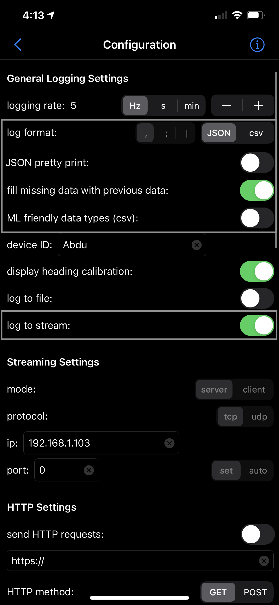
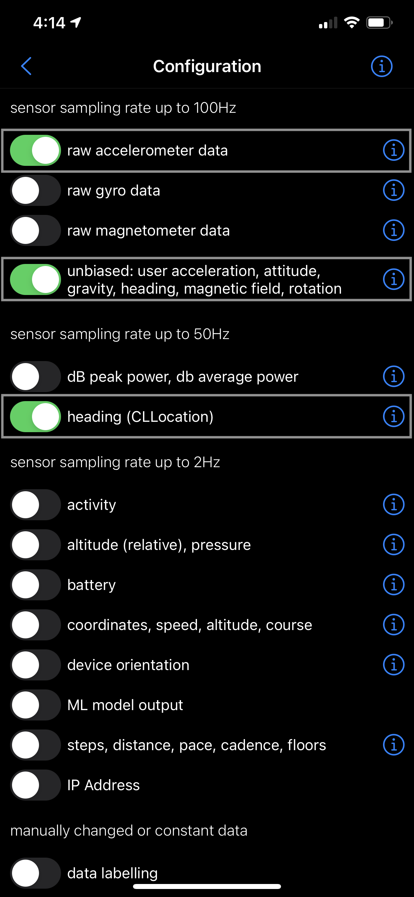
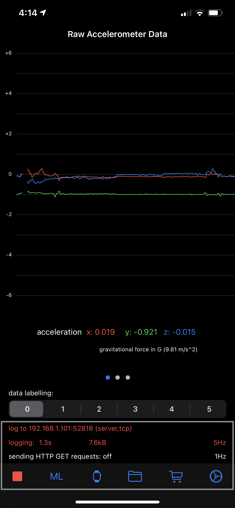

<!-- ABOUT THE PROJECT -->
# The Kingdom of Illea

The Kingdom of Illea is a single-player text-based Role-Playing Game that has been implemented using Java. It is an interactive game as it allows a single player to roam about in a virtual environment, interact with various characters, collect artifacts and move towards collecting points and staying alive. It also has phone sensors incorporated into it which enhances the interactivity in the game as well as the experience.


<!-- GETTING STARTED -->
## Getting Started

To get a local copy up and running follow these simple steps.

### Prerequisites

This is an example of how to list things you need to use the software and how to install them.
* Java Development Kit ([JDK](https://docs.oracle.com/en/java/javase/15/install/overview-jdk-installation.html#GUID-8677A77F-231A-40F7-98B9-1FD0B48C346A))
* [SensorLog](https://apps.apple.com/us/app/sensorlog/id388014573) iOS Application

### Installation

1. Use the package manager [Git](https://git-scm.com/) to clone this [repo](https://github.com/abduwaly-cmd/Kingdom-of-Illea)
   ```sh
   git clone https://github.com/abduwaly-cmd/Kingdom-of-Illea.git
   ```

2. Run the SensorLog App on your phone and configure it as seen below -
  <p float="center" align="center">
    
     
    
  </p>

3. Run the game directly from terminal after switching to its directory using the following commands
   ```sh
   cd Kingdom-of-Illea/
   java -cp out/production/myProject:src/com/myProject/lib/json-simple-1.1.jar com.myProject.Driver.Main
   ```

4. Successfully start the game by entering the IP & Port number displayed on the phone screen onto the console and *enjoy* :)

<!-- CONTRIBUTING -->
## Contributers
Project was built as a part of our AUS Software Design (COE312) course by -
* Abdulrahman Waheed
* Asma Al-Meer
* Sarah Al-Dulaimi
* Ahmed Hamad

<!-- CONTACT -->
## Contact

Your Name - [@abduwa1y](https://twitter.com/abduwa1y) - [abdulrahmanwaheedali@gmail.com](mailto:abdulrahmanwaheedali@gmail.com)

Project Link: [https://github.com/abduwaly-cmd/Kingdom-of-Illea](https://github.com/abduwaly-cmd/Kingdom-of-Illea)

<!-- LICENSE -->
## License

Distributed under the MIT(https://choosealicense.com/licenses/mit/) License. See `LICENSE` for more information.
