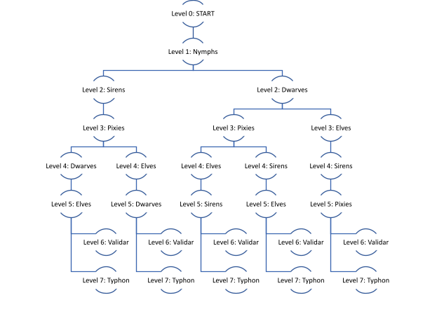

<!-- ABOUT THE PROJECT -->
# The Kingdom of Illea

The Kingdom of Illea is a single-player text-based Role-Playing Game that has been implemented using Java. It is an interactive game as it allows a single player to roam about in a virtual environment, interact with various characters, collect artifacts and move towards collecting points and staying alive. It also has phone sensors incorporated into it which enhances the interactivity in the game as well as the experience.


<!-- GETTING STARTED -->
## Getting Started

To get a local copy up and running follow these simple steps.

### Prerequisites

This is an example of how to list things you need to use the software and how to install them.
* Java Development Kit ([JDK](https://docs.oracle.com/en/java/javase/15/install/overview-jdk-installation.html#GUID-8677A77F-231A-40F7-98B9-1FD0B48C346A))
* [SensorLog](https://apps.apple.com/us/app/sensorlog/id388014573) iOS Application

### Installation

1. Use the package manager [Git](https://git-scm.com/) to clone this [repo](https://github.com/abduwaly-cmd/Kingdom-of-Illea)
   ```sh
   git clone https://github.com/abduwaly-cmd/Kingdom-of-Illea.git
   ```

2. Run the SensorLog App on your phone and configure it as shown below -
  <p float="center" align="center">
    
     
    
  </p>

3. Run the game directly from terminal after switching to its directory using the following commands
   ```sh
   cd Kingdom-of-Illea/
   java -cp out/production/myProject:src/com/myProject/lib/json-simple-1.1.jar com.myProject.Driver.Main
   ```

4. Successfully start the game by entering the IP & Port number displayed on the phone screen onto the console and *enjoy* :)


<!-- Specifications -->
## Specifications
This game although it might seem a simple text-based game. Alot of work went behind it in order to make it an interactive experience with **Multiple scenes/characters/objects** with rich contextual relationships. For instance, here is a *tree* that shows the levels/scenes of the game. Thus, each player can have a unique experience depending on the choices they make throughout the game.

<br />
<br />
Moreover, it was only filling to use the **phone sensors** in order to maximize the interactivity of the player throughout the game and make it more fun. Thus sensors were deeply incorporated into the game in taking trivial actions such as turning the phone to *move* between maps, swinging it to *fight* monsters/enemy.
<br />
<br />
**Multithreading** has also been used and implemented throughout the game, mainly as a *counter* to see how long it takes the player to finish the game and adjust the final level difficulty accordingly as the difficulty increases the longer the player takes in the gmae.
<br />
<br />
Lastly, basic **design patterns** were used in the design and implementation of the structure of this game such as the *Singleton, Subject/Observer, Command, State and Template Patterns* for various purposes.


<!-- CONTRIBUTING -->
## Contributers
Project was built as a part of our AUS Software Design (COE312) course by -
1. Abdulrahman Waheed
2. Asma Al-Meer
3. Sarah Al-Dulaimi
4. Ahmed Hamad

<!-- CONTACT -->
## Contact

Abdulrahman Waheed - [@abduwa1y](https://twitter.com/abduwa1y) - [abdulrahmanwaheedali@gmail.com](mailto:abdulrahmanwaheedali@gmail.com)

Project Link: [https://github.com/abduwaly-cmd/Kingdom-of-Illea](https://github.com/abduwaly-cmd/Kingdom-of-Illea)

<!-- LICENSE -->
## License

Distributed under the [MIT](https://choosealicense.com/licenses/mit/) License.
